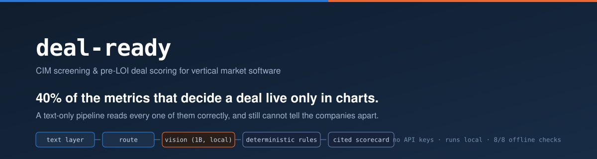
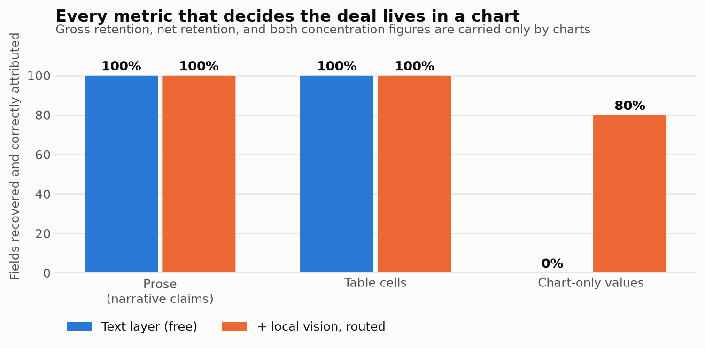
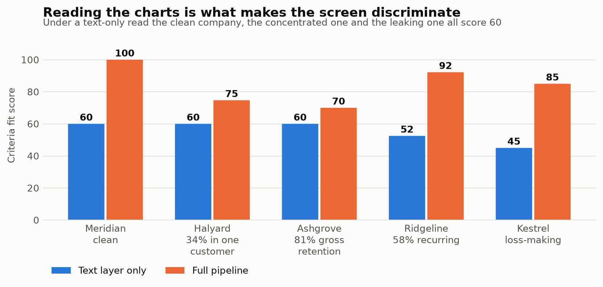
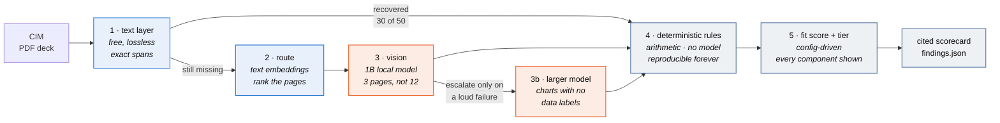
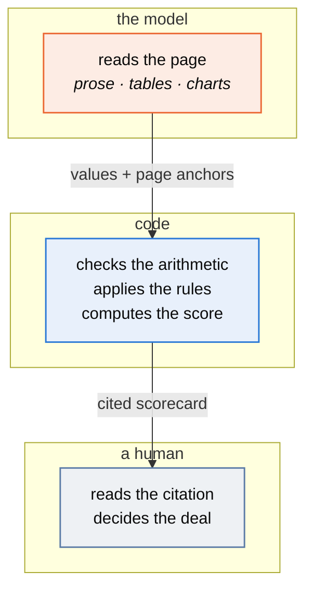

A confidential information memorandum lands in an inbox: 40-odd pages of prose, tables
and charts describing a software company that is for sale. An analyst spends two to
four hours pulling ten numbers out of it into a spreadsheet, checking them against an
investment profile, and writing a one-page recommendation. Around nine in ten of those
memoranda end in "pass".

This is a first pass at that work. Point it at a CIM, get back a cited scorecard: the
metrics, the arithmetic checked, the criteria fit scored, the risks flagged, and a
tier. It does not recommend a transaction. It produces the artifact the analyst was
going to assemble by hand, with every figure traceable to the page it came from, and
hands the judgement back.

```bash
pip install -r requirements.txt
python generate.py                 # build the synthetic corpus (no model, no network)
python screen.py data/             # screen it
python run_checks.py               # verify every number in this README, offline
```

Python 3.12, no API key, no account, no paid inference. The parts that need a model
use **local models via Ollama**; everything else is stdlib-first Python. If you have no
models installed, `python screen.py data/ --no-vision` still runs end to end — and the
gap between those two runs is the most interesting thing here.

---

## The finding

A CIM is a deck, and its numbers do not all live in sentences. In this corpus
**20 of 50 metrics — 40% — exist only inside rasterised charts**, verified absent from
the text layer by a leak check that fails the build if one escapes.

It is not a random 40%. It is gross retention, net retention, largest-customer
concentration and top-five concentration: **every metric that decides whether to buy
the company.** Revenue, margin and EBITDA — which a text layer reads perfectly — only
tell you how big it is.



Here is what that costs where it matters — the same five companies, the same rules,
the only difference being whether the pipeline could read a chart:



Three companies with materially different risk, one identical score. A text-only
pipeline does not degrade gracefully — it goes blind exactly where the decision lives,
and it does so *silently*, because every field it did read, it read correctly.

That is the argument for a heavier parser. Not "vision models are better at tables."

---

## How it works



Steps 1–3 exist to make step 4 possible. Blue is free, orange is the step that costs
something, grey decides nothing on its own.

**The model reads. Code decides. A human signs.** Every number the business acts on is
computed in Python from values a parser extracted, never generated by a model. That is
not caution for its own sake — it is what lets a deal lead re-run a screen from a year
ago and get the same answer, and it is why most of the work costs nothing.

**Routing keeps the expensive step small.** Vector search is arithmetic; reading is
inference. A k=1 router selects 3 of 12 pages, and nothing is lost, because the pages
carrying charts also carry text describing what they show.

**Nothing recommends a transaction.** The tier sorts an inbox. A `Pass` means "not a
fit against this profile", never "bad company" — the profile in `criteria/default.json`
is config, and swapping in a real scorecard is a config change rather than a rewrite.

---

## What it validates

Ten VMS metrics, then eleven deterministic rules over them — ARR tying to annualised
MRR, recurring-revenue floor, retention floors, margin floor, profitability, mandate
band, concentration caps. Each finding is graded blocker / warning / info and carries
its citation.

Two of those rules are worth calling out, because they are where domain judgement shows
up rather than arithmetic:

- **Gross retention above 100% is reported as a definition error, not a triumph.** GRR
  excludes expansion by construction, so a figure above 100 means net retention has
  been labelled gross.
- **Rule of 40 is computed and deliberately scored at zero weight.** It is a
  growth-investor test: it asks whether a company is buying growth with margin, which
  is the right question when you need a step-up at exit. A permanent-capital buyer is
  not underwriting an exit — it wants a profitable, sticky, slow-growing business, which
  fails Rule of 40 *by construction*. During development this rule fired on all five
  targets including the clean one, which is the tell that a metric has been imported
  from the wrong thesis. It is kept as context and never allowed to move the score.

**A missing metric is a finding, not a zero.** A CIM that omits gross retention has
usually omitted it deliberately, and that becomes the first management-call question
rather than a silent gap in the average.

### Where the trust boundary sits



**The model never computes a number the business acts on.** It extracts with a page
anchor; code does the arithmetic; a human checks the citation and makes the call. That
is what lets a deal lead re-run a screen from a year ago and get the same answer.

---

## The numbers

Reproduce all of them with `python run_checks.py` — offline, from committed artifacts.

**Layer P — what each parse backend makes available.** Percentage of ground-truth
fields recovered *and correctly attributed to their metric*, on the page the value
actually lives on. This grades the parser, not the extractor: it is a ceiling on what
any downstream model could possibly achieve given what it was handed.

See [`reports/layer_p.md`](reports/layer_p.md) for the generated table.

**Layer R — routing.** Recall@k for the page carrying each metric, and the reduction
in pages sent to the vision model. Read the carrier breakdown rather than the
aggregate: routing recovers **100% of chart pages at rank 1** — the only ones that need
a vision model — while ranking prose and table pages poorly, which costs nothing
because those were never going to the expensive step. At k=1 it selects **15 of 60
pages, a 75% cut**, and misses no chart field.
See [`reports/layer_r.md`](reports/layer_r.md).

**The capability boundary worth knowing.** Chart fields split cleanly by whether the
chart printed its data labels — and the boundary is specific, not "bigger is better":

| Backend | Charts with data labels | Charts read off the axis |
|---|---|---|
| text layer | 0% (0/10) | 0% (0/10) |
| `minicpm-v4.6` (1B, 1.6GB) | **100% (10/10)** | 0% (0/10) |
| tiered, escalating to `qwen3.5:4b` | 90% (9/10) | 70% (7/10) |

Reading a printed label is recognition. Reading a value off an axis is spatial
reasoning about where a point sits between gridlines. The 1B model cannot do the second
at all — and crucially it **fails loudly**, returning no numbers rather than guessing,
which is what makes cheap-first escalation safe.

**Where that leaves the numbers you can act on.** Axis-read values reach ~70% even after
escalation. That is useful for triage and **not acceptable for a figure that reprices a
deal**. The consequence is not a better prompt: it is to treat axis-read values as
flagged for human confirmation, and to ask the seller for the underlying data rather
than inferring it from a picture.

**A tiering lesson that cost real time.** The first escalation trigger escalated any
page mentioning something "unreadable". Across the corpus that fired on **16 of 20
pages**, including prose and table pages the 1B model had already transcribed
perfectly — 1,183s of escalation where roughly two thirds bought nothing. Requiring
*no numbers at all* on the page before escalating brings it to **5 of 20 — exactly the
five unlabelled retention pages — at ~370s.** An escalation trigger is a classifier,
and an unmeasured one quietly spends the budget the tiering was meant to save.
([`deal_ready/parse/tiered.py`](deal_ready/parse/tiered.py))

**A caveat stated plainly:** the corpus is synthetic and this repo wrote it. Ground
truth is a by-product of generation rather than labelling after the fact, which
removes one class of error but not the deeper one — a generator and a scorer authored
in the same session are favourable to each other by construction. The
`realworld/` manifest exists to test against public documents this pipeline did not
write.

---

## Honest boundaries

- **Synthetic corpus.** These are generated CIMs modelled on publicly described
  conventions. No real memorandum, no real company, no proprietary deal flow.
- **Extraction is deterministic here, not model-driven.** The end-to-end run tests
  *stated* values against parsed text, which is what keeps it reproducible offline. A
  production build puts a structured-output model call at that seam; the interface and
  the eval harness would not change, which is why the seam exists.
- **The judgement layer is not built yet.** Ashgrove scores well on numbers and is the
  most dangerous company in the corpus — founder-written settlement engine, no
  succession plan, unsupported database, no test coverage. None of that is visible to
  arithmetic. Catching it needs a calibrated judge scored against a held-out labelled
  set, and until that exists this reads the numbers and not the narrative.
- **Not a data-room tool.** The parse answer here would change at 10–50K pages; see
  [`docs/ingest.md`](docs/ingest.md) §8.

---

## Reading order

| File | What it is |
|---|---|
| [`docs/ingest.md`](docs/ingest.md) | **The design record.** Why OCR is the wrong default, why whole-document multimodal is also wrong, what embeddings do and do not do, the corpus-size ladder, what was tried and rejected, and two failures that would have published false findings |
| [`docs/metrics.md`](docs/metrics.md) | Every VMS metric: what it is, why a buy-and-hold acquirer prices on it, how a CIM obscures it |
| [`docs/rules.md`](docs/rules.md) | Every rule with its deal rationale |
| [`playbook.md`](playbook.md) | The rollout half: shadow mode, who to build with, what will actually go wrong |
| [`docs/hardware.md`](docs/hardware.md) | Local model setup, AMD/ROCm traps, and three failures that would have published false findings |
| [`criteria/default.json`](criteria/default.json) | The investment profile — config, not code |
| [`deal_ready/scorer/rules.py`](deal_ready/scorer/rules.py) | The deterministic spine |

---

## Layout

```
generate.py            build the synthetic corpus; fails if a chart value leaks to text
screen.py              the CLI an analyst would run
parse_corpus.py        run every parse backend, write Layer P
run_checks.py          reproduce every published number, offline

deal_ready/
  generator/           target profiles + PDF deck rendering
  parse/               text layer · OCR (optional) · vision, behind one interface
  embed/               page routing, MaxSim in numpy, no vector database
  scorer/              deterministic rules + criteria fit
  models/ollama.py     the single door every model call goes through
  values.py            what counts as recovering a number

criteria/              investment profiles
data/                  generated corpus, ground truth, committed vision cache
reports/               generated results
realworld/             manifest of public documents for the spot check (no PDFs committed)
```

Money is whole dollars, integers everywhere. This thing claims figures tie out, and
floats would make that a lie.
