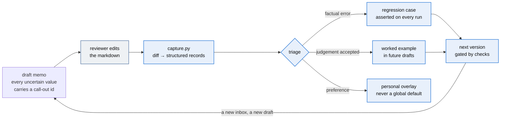

A confidential information memorandum lands in an inbox. Forty-odd pages of prose, tables
and charts about a software company that's for sale, and somewhere in there are the ten
numbers an analyst actually needs. Finding them takes two to four hours, a spreadsheet, and
a one-page recommendation. About nine in ten of those memos end in "pass" anyway.

This is a first pass at that work. Point it at a CIM and you get what the analyst was going
to assemble by hand: the metrics, the arithmetic checked against the buyer's rubric, a fit
score and a tier, and a drafted memo where every uncertain value carries a call-out. Every
figure traces to the page it came from. Nothing here recommends a transaction. It sorts an
inbox and asks questions, and a human signs.

## Two ways to run it

**As a plugin.** The judgement lives in skills and subagents, so a fresh agent session can
screen a CIM with no clone, no Python and no models.

```
/plugin marketplace add situhacks/deal-ready
/plugin install deal-ready
/deal-ready:screen path/to/cim.pdf
```

Three commands: `screen` runs the workflow, `review` checks numbers you already wrote,
`research` builds market context on its own.

**As a repo.** Clone it for the local models, the corpus generator, and the checks that
reproduce every number here offline.

```bash
pip install -r requirements.txt
python generate.py                 # build the synthetic corpus (no model, no network)
python screen.py data/             # screen it: scorecards + findings
python memo.py data/               # draft screening memos with call-outs
python review.py data/T05_Ashgrove_CIM.pdf reports/asserted_T05.json   # check your numbers
python run_checks.py               # verify every number in this README, offline
```

Python 3.12, no API key, no account, no paid inference. The parts that need a model use
local models through Ollama. With nothing installed, `python screen.py data/ --no-vision`
still runs end to end, and the gap between that run and the full one is the most interesting
thing here.

Both paths screen against the same rubric. `criteria/default.json` is copied into the plugin
and byte-compared by `run_checks.py`, so they can't drift apart.

### What you get

- A cited scorecard per target: ten software metrics against the buyer's rubric, eleven
  deterministic rules, a fit score and a tier. Generated from the config as readable
  markdown, so you can click into any verdict.
- A drafted memo where every uncertain value carries a call-out id.
- Chart-only values measured from pixels rather than guessed by a model, each one
  independently re-read, with the agreement recorded in the memo.
- A correction loop. Review the memo, run one command, and your edits become regression
  cases and worked examples that the checks assert on every future run.
- Reviewer mode, which flips the usual arrangement: you write the numbers, it checks them
  and reports what disagrees, what agrees, and what it couldn't check. The third bucket
  matters most. A checker that only speaks up when it finds something is teaching you that
  silence means correct.
- Market context on the plugin path: the benchmark band for each deciding metric, from a
  vetted whitelist of publishers. 81% gross retention means nothing until you know the
  published median for that size cohort is 91%.

### A full run, already committed

Every artifact below is in the repo. Nothing to re-run. One target, Ashgrove, and the whole
loop. These came from the repo path, since that's the one whose numbers re-derive offline.
The plugin produces the same shapes. Market context is the exception, and came from the
plugin path, because researching needs the web.

| Step | Artifact |
|---|---|
| the input | [`data/T05_Ashgrove_CIM.pdf`](data/T05_Ashgrove_CIM.pdf) |
| the rubric it's judged against | [`reports/scorecard_template.md`](reports/scorecard_template.md) |
| the scorecard | [`reports/scorecard_T05.md`](reports/scorecard_T05.md) — 97.7, tier 1, one red-letter breach: gross retention 81% against an 85% floor |
| the same, machine-readable | [`reports/findings.json`](reports/findings.json) |
| the market context | [`reports/market_context_T05.md`](reports/market_context_T05.md) — no agriculture-specific band exists, so it says so; at $4.3M ARR the cohort median is 91% GRR against this target's 81% |
| the drafted memo | [`reports/memo_T05.md`](reports/memo_T05.md) — call-out ids, the chart values and their re-read, the questions for the seller |
| the call-outs, machine-readable | [`reports/callouts_T05.json`](reports/callouts_T05.json) |
| a human's review of it | [`reports/memo_T05_reviewed.md`](reports/memo_T05_reviewed.md), and the session it produced: [`data/corrections/T05_session01.json`](data/corrections/T05_session01.json) |
| what that review taught | [`eval/regressions.json`](eval/regressions.json) and [`eval/judgement_examples.json`](eval/judgement_examples.json), asserted on every run |

The other four targets sit beside these: [`memo_T01.md`](reports/memo_T01.md) through
[`memo_T04.md`](reports/memo_T04.md), their scorecards and call-outs, and the reader
comparison in [`reports/bakeoff.md`](reports/bakeoff.md).

**Contents**: [Walkthrough](#the-walkthrough) · [How it works](#how-it-works) ·
[The loop](#the-loop) · [The finding](#the-finding) · [The numbers](#the-numbers) ·
[v1 → v5](#the-story-v1--v5) · [Forecasting](#what-happened-when-we-tried-to-forecast) ·
[Boundaries](#honest-boundaries) · [Inside the plugin](#inside-the-plugin) ·
[Reading order](#reading-order) · [Layout](#layout)

---

## The walkthrough

Seven stages, three of which stop and wait for you. The gates aren't decoration: the values
most likely to be wrong are the ones a reader can't tell apart from the ones that are right,
so they get surfaced before they're scored rather than after they're signed.

### 1 · Read

A reader worker goes through the pages and returns structured values, each with the page it
came from and how it was read:

| `read` | Means | Trust |
|---|---|---|
| `text` | Printed in prose | high |
| `table` | A labelled table cell | high |
| `label` | A printed value on a chart | high |
| `axis` | Measured off chart geometry, nothing printed says it | low, always |

That last row is why I built this. On the sample target, gross retention isn't written
anywhere. It's a dot on a line chart, and it's the number that breaches the rubric.

### 2 · Compute

Deterministic. Arithmetic and thresholds from `criteria/default.json`: eleven rules, a fit
score, a tier. No model computes a number the business acts on. Derived values get computed
rather than trusted, and a stated figure that disagrees with a computed one becomes a
definition conflict, not a rounding decision.

### 3 · ⏸ Gate — confirm the uncertain reads

It shows you every value with its read type and stops. You confirm or correct anything
measured off an axis before it's scored. Answer in chat and it carries on.

### 4 · Research

A metric without a benchmark isn't a screen. 81% gross retention means nothing until you
know where the band starts. So this is a scoped four-phase pass rather than a lookup, with a
worked example in [`reports/market_context_T05.md`](reports/market_context_T05.md).

It starts from a source whitelist rather than a search box. `references/sources.md` lists
publishers that state their sample and method, a blacklist `run_checks.py` enforces (cite a
banned domain in a committed report and the build fails), and a map of which verticals
actually have a published band. Searching an open index and assigning source tiers
afterwards isn't method. It's how a content-farm number ends up in a memo with a tier label
on it.

It also carries two standing corrections that change what most figures mean. Published
retention medians come from opt-in surveys and run 5–10 points high, because outperformers
volunteer and distressed companies aren't around to answer. And deal size predicts multiple
more strongly than vertical does.

Then four typed passes, run separately because they ask different questions:

| Pass | The question | Good output |
|---|---|---|
| Benchmark | What's normal here? | A range, dated, from a named source |
| Comparable | What did similar businesses transact at? | Named deals, values, multiples |
| Trend | Which way is this vertical moving? | Dated direction with a magnitude |
| Critical | What would make this worse than the band suggests? | Specific, falsifiable risks |

The critical pass is required. If the research only found reasons the number looks fine, it
wasn't researched, it was confirmed.

No claim survives without all five fields — statement, source, URL, a verbatim quote under
125 characters, a date — plus a source tier. Every deciding metric ends with a band or a
named gap, no band rests on a single vendor source, and contradictions stay contradictions
rather than getting averaged into a middle number nothing supports.

The researcher never sees the document. It gets metric names, values and the vertical. A
confidential CIM must not end up in a web query, so that isolation sits in the agent's tool
allowlist and gets asserted in `run_checks.py` rather than promised in a paragraph.

Context is never a verdict — it doesn't move a score or a tier. On T05 it found no
agriculture-specific band exists at all and reported that as a gap, then found that at $4.3M
ARR the target sits in a cohort whose published median gross retention is 91% against its
own 81%. The rubric said "missed a floor by four points." The research said "retains ten
points worse than the companies it most resembles." Same number, different question to ask
about it. It then applied the opt-in survey correction in the target's favour, because
that's what the correction says to do, and the ten-point deficit survives it.

### 5 · ⏸ Gate — the scorecard, in context

Scorecard beside the benchmarks, so each number reads against something. Anything still
unresolved gets named. It asks whether to draft.

### 6 · Draft

A memo where every figure cites its page and every uncertain value carries a call-out. A
call-out is a question with an answer that would resolve it, not a warning label. Four
kinds: axis read, missing metric, definition conflict, judgement.

### 7 · ⏸ Gate — hand back

What was written and what's still open. It doesn't close on a summary implying more
certainty than the file has.

### Then the loop closes

Edit the memo. `python capture.py` diffs your edits into correction records. Accepted
judgement becomes a worked example in future prompts, extraction gaps become regression
cases the checks assert forever. Your corrections are the only training signal, and they're
gated, committed and reviewable.

---

## How it works

```mermaid
flowchart LR
    PDF["CIM<br/>PDF deck"] --> TL["1 · text layer<br/><i>free, lossless<br/>exact spans</i>"]
    TL -->|"recovered<br/>30 of 50"| RULES
    TL -->|"still missing"| RT["2 · route<br/><i>text embeddings<br/>rank the pages</i>"]
    RT --> V["3 · read<br/><i>0.9B parser<br/>routed pages only</i>"]
    V -->|"page yields<br/>no values"| CH["3b · chart specialist<br/><i>one call: labels · ticks<br/>· estimates</i>"]
    CH --> GEO["3c · geometry<br/><i>code measures the pixels<br/>against those ticks</i>"]
    V --> RULES
    GEO --> RULES
    RULES["4 · deterministic rules<br/><i>arithmetic · no model<br/>reproducible forever</i>"] --> FIT["5 · fit score + tier<br/><i>config-driven<br/>every component shown</i>"]
    FIT --> OUT["cited scorecard<br/>findings.json"]

    classDef free fill:#e8f0fb,stroke:#2a78d6,stroke-width:1.5px,color:#0b0b0b
    classDef paid fill:#fdece4,stroke:#eb6834,stroke-width:1.5px,color:#0b0b0b
    classDef det  fill:#eef1f4,stroke:#5b7ba6,stroke-width:1.5px,color:#0b0b0b
    class TL,RT free
    class V,CH,GEO paid
    class RULES,FIT,OUT det
```



Steps 1–3 exist to make step 4 possible. Blue is free, orange is the step that costs
something, grey decides nothing on its own.

The model reads, code decides, a human signs. No number the business acts on is computed by
a model. That's what lets a deal lead re-run a screen from a year ago and get the same
answer, and it's why most of the work costs nothing.

I did check whether the strongest model should just read everything. The bake-off measured
every candidate as a full-page reader on the same pages
([`reports/bakeoff.md`](reports/bakeoff.md)). The newest open frontier model read 80% of
prose fields (it paraphrases) and 80% of chart values, at 148 seconds a page. A 0.9B
specialized parser read 100% of prose, tables and labelled charts in 5 seconds, and dropped
unlabelled chart interiors entirely.

No single winner, but a best reader for each job, so the pipeline assigns each job directly.
The parser reads every routed page. A page that yields no values goes to the frontier model,
whose one call supplies the series labels, the tick glyphs and its own estimated values, and
then code measures the endpoints against those ticks. The estimates never get used as
numbers — they exist to be compared against the measurement, and the memo reports whether
the two agree.

Nothing here recommends a transaction. The tier sorts an inbox. A `Pass` means "not a fit
against this profile", never "bad company". The profile in `criteria/default.json` is
config, so swapping in a real buyer's scorecard is a config change rather than a rewrite.

---

## The loop

The pipeline is a straight line. The loop is what makes the tool improve, and it starts with
a human.



Reviewer corrections are the real eval set. Three things make this a loop rather than a
suggestion box:

- Blind spots are the headline metric. When a reviewer corrects something no flag prompted,
  the record says so. Those are the most valuable lines in the file, because they measure
  what the system didn't know to flag.
- Every accepted correction has to teach. If an accepted judgement never became a worked
  example, or an extraction gap was never locked by a regression, `run_checks.py` fails.
- Corrections change the next version, never the current one. The recursion runs on a
  release cadence a person can audit, and the changelog names who taught what.

The first review session showed the whole loop working. A reviewer caught page 7 of one
target announcing a retention chart while both values came back unread. That blind spot
became a mechanical upgrade, the upgrade became a fix, and two regressions now fail if those
values ever go dark again.

---

## The finding

A CIM is a deck, and its numbers don't all live in sentences. In this corpus, 20 of 50
metrics exist only inside rasterised charts, and a leak check fails the build if one of them
escapes into the text layer.

It isn't a random 40%. It's gross retention, net retention, largest-customer concentration
and top-five concentration — the metrics that decide whether to buy the company. Revenue,
margin and EBITDA, which a text layer reads perfectly, only tell you how big it is.


Same five companies, same rules, the only difference being whether the pipeline could read a
chart:


Only two bars, deliberately. The plugin path reads the same values, so it produces the same
scores; there's no third line to draw. What separates the substrates is cost and
reproducibility, not what they see
([`reports/substrate_comparison.md`](reports/substrate_comparison.md)).

Three companies with materially different risk, one identical score. A text-only pipeline
doesn't degrade gracefully. It fails on exactly the metrics that decide the question, and it
fails silently, because every field it did read, it read correctly.

---

## The numbers

Reproduce all of them with `python run_checks.py`, offline, from committed artifacts.

**Layer P** is what each parse backend makes available: the share of ground-truth fields
recovered and correctly attributed, on the page the value actually lives on. It grades the
parser rather than the extractor, so it's a ceiling on what anything downstream could manage
([`reports/layer_p.md`](reports/layer_p.md)).

**Layer R** is routing. Recall@k for the page carrying each metric, and how many pages the
vision step has to read. Routing recovers 100% of chart pages at rank 1, so at k=1 it
selects 15 of 60 pages, a 75% cut, and misses no chart field
([`reports/layer_r.md`](reports/layer_r.md)).

Chart fields split cleanly by whether the chart printed its data labels:

| Backend | Charts with data labels | Charts read off the axis |
|---|---|---|
| text layer | 0% (0/10) | 0% (0/10) |
| `minicpm-v4.6` (1B general VLM, page render) | 100% (10/10) | 0% (0/10) |
| `glm-ocr` (0.9B parser, page render) | 100% (10/10) | 0% (0/10) |
| `qwen3.8:27b` (open frontier, page render) | 100% (10/10) | 80% (8/10) |
| production pipeline (parser + chart specialist + geometry) | **100% (10/10)** | **100% (10/10)** |
| plugin path (frontier reader, one page at a time) | **100% (10/10)** | **100% (10/10)** |

Both substrates read this corpus perfectly, 20 of 20 chart-carried values, exact, no
tolerance applied ([`reports/substrate_comparison.md`](reports/substrate_comparison.md)).
The last two rows aren't like-for-like: the bake-off graded a model as a full-page reader
over a whole document, while the plugin path reads one chart page at a time with explicit
instructions. Task framing is doing work there, not just model capability.

Reading a printed label is recognition. Reading a value off an axis is spatial reasoning, so
it depends on the substrate and the framing. Quantised, over whole page renders,
`qwen3.8:27b` read 8 of 10 axis values at 148 seconds a page, which is fine until the
arithmetic needs the two it missed. Handed one chart at a time, a hosted frontier model got
all ten.

So the reason to measure isn't that a model can't do this. It's that a model's answer is an
assertion and a measurement is evidence. The chart model reads the tick glyphs once, then
code finds each series by colour, fits the centreline of the line entering the end marker,
and interpolates against the gridlines. That's arithmetic, and it re-runs from the committed
images on any machine with no GPU and no model.

Which substrate, then? Not an accuracy question, since this corpus can't separate them:

| | Local | Plugin |
|---|---|---|
| Latency, 1 target (warm cache) | 2.6s | seconds per page, 2 pages |
| Marginal cost per document | electricity | tokens |
| Needs | a GPU and three pulled models | nothing |
| Re-derivable by a third party, offline, forever | **yes** | **no, it can only be re-run** |
| Failure mode | loud: an unreadable page is reported unresolved | model-shaped: a confident wrong number is possible |

That fourth row decides it. A number the local path produced can be re-derived by someone
who doesn't trust you. A number the plugin produced can only be re-run, against a model that
may have changed underneath you. For a screen a deal lead might have to defend a year later
those aren't the same thing, which is why the plugin is the convenient way in and the repo
is the one that publishes numbers.

One caveat: the corpus is synthetic and this repo wrote it. A generator and a scorer
authored in the same session are favourable to each other by construction. The `realworld/`
manifest exists to test against public documents this pipeline didn't write.

---

## The story: v1 → v5

**v1** asked whether the work could be done at all, locally. The text layer, the embedding
router, tiered local vision, deterministic rules, and the finding that the decisive 40% of
metrics live only in charts. Every model output was committed, so every number could be
re-verified without a GPU.

**v2** asked what the analyst would write next. The memo, with call-outs derived
mechanically, diff-based correction capture, and the fold-back contract. Its first review
session caught a real blind spot, and that lesson is still the regression guarding it.

**v2.1** asked why the axis column sat at 70%. The strong tier was estimating: reasoning on,
lossy page renders. Reasoning off, exhibit re-reads from the PDF's own embedded image, and
pixel measurement in code closed it to 20/20.

**v3** asked whether any of this was the right way or just my way. Research into the 2026
document-parsing field turned up specialized parsers beating frontier models at
transcription, no benchmark scoring chart interiors at all, and leaderboard gaps smaller
than run-to-run noise. So I settled it with a bake-off on these pages. The reader changed,
the guarantees didn't.

**v4** asked whether any of this travels. Everything up to that point needed one machine
with three models pulled, so the judgement moved into a plugin that runs with nothing else,
while the repo kept the local models and the committed evidence.

Then a cold agent was handed the repo and told to find the instructions. It screened the
target correctly and then found the scoring rule had never been written down: binary award
gives 70 and Tier 2 where proportional gives 97.7 and Tier 1, so a plugin user and a repo
user reached different verdicts on the same company. Chasing that turned up something worse
nobody had reported: a check suite that wrote its deterministic run straight into `reports/`
and degraded the committed artifacts every time anyone verified them.

**v5** asked what the document can't contain. A retention line is lagging by construction.
It can't hold a customer who hasn't left yet, so a healthy number and a collapsing customer
base are perfectly consistent, and only one of them is in the deck. The memo gained the
other one: customer health, outward research, and a base rate from past acquisitions.

The base rate is the answer to having no future history for a target. You have every other
company's future. On the sample target the matched cohort of sixteen grew a median 2.1% a
year, one in eight shrank, and the case ran 3.95 points optimistic on every one of them. The
memo prints the sixteen deal ids it recomputes from.

Then I pointed the layers at real companies and one of them broke. A $900M target was
matched to a cohort of $20–28M deals and reported cleanly, because the top size band was
open-ended. Five synthetic targets all inside the mandate band could never have surfaced it.
Every enrichment layer now fails loudly, and none of them can reach the score.

---

## What happened when we tried to forecast

A screen reads history off a document, so the obvious next question is whether a model can
extend it. Five experiments answered that, and the answer was no. The reason is specific
enough to be worth publishing. Full record in
[`reports/enrichment_experiments.md`](reports/enrichment_experiments.md), reproducible from
[`eval/`](eval/).

TimesFM (Google), Chronos (Amazon) and their kin are time-series foundation models. They're
pretrained on billions of points from unrelated series, then handed a sequence they've never
seen and asked for the next N values, with no training on your data at all. Scored with
MASE: error divided by the error of just repeating last year's value, so 1.0 means the model
did no better than doing nothing.

On synthetic data it looked excellent, and that was the problem. TimesFM-3 came in 46%
better than the best baseline, 0.354 against drift at 0.660. Then I read the generator back
and found I'd authored a decay into the holdout period, so the model was recovering a
pattern I'd put there myself. A synthetic corpus can't validate a forecaster, because
whoever wrote the corpus knows the future.

So I ran it against real companies: six vertical software filers from SEC EDGAR XBRL, where
every quarterly value carries its accession number, form type and filing date
([`deal_ready/realworld/edgar.py`](deal_ready/realworld/edgar.py)).

| Mean MASE, 6 real filers | 1 year out | 2 years out |
|---|---|---|
| seasonal naive | 1.286 | 2.239 |
| linear fit | 0.823 | 1.287 |
| drift | 0.507 | **0.718 — best** |
| TimesFM-2.5 | 0.589 | 1.432 |
| TimesFM-3 | 0.502 | 0.846 |
| Chronos-2 | **0.402 — best** | 1.094 |

At one year a foundation model wins, and Chronos-2 wins it at 0.95s against TimesFM's 5.5s.
At two years plain arithmetic wins outright and every foundation model degrades past it.

Then the experiment that settled it: how much history does it actually need? Same six
companies, truncated to progressively less:

| History given, quarters | Best baseline | TimesFM-3 |
|---|---|---|
| 4 | linear fit 0.935 | **1.472 — worse than doing nothing** |
| 6 | linear fit 0.377 | 0.526 |
| 8 | linear fit 0.335 | **0.305 — overtakes** |
| 24 | drift 0.435 | 0.349 |

Eight observations is the threshold, and a CIM prints three to five annual points. At four,
nothing works — not the foundation model, not the baselines, not what you'd have done by
hand. That isn't a tuning problem, it's an information problem, and it closes the question.
Forecasting doesn't belong in a CIM screen.

Two smaller findings, kept because they cost real time. Covariates mostly hurt: handing the
model a sector index made one-year accuracy worse, 0.358 against 0.412, and helped only when
the cohort's own future was supplied at the long horizon, which requires knowing something
you wouldn't know. And TimesFM-2.5 is Apache-2.0 while TimesFM-3 isn't commercially
licensed, which settles it for anyone shipping this rather than testing it.

What replaced it: if the target has no future history, use everyone else's.
`signals/baserate.py` computes what comparable past acquisitions went on to do, prints the
deal ids, and refuses when the cohort is too small or the target sits outside the book. And
`signals/scenario.py` emits assumptions that can be disproved rather than a number, which is
the more useful thing to hand a committee.

The forecasting harnesses stay in `eval/` as an exhibit. Nothing in `eval/forecast*.py` is
reachable from the screening path, and `run_checks.py` fails the build if it ever becomes so.

---

## Honest boundaries

- The corpus is synthetic, modelled on publicly described conventions. No real memorandum,
  no real company, no proprietary deal flow.
- Extraction is deterministic here rather than model-driven. The end-to-end run tests stated
  values against parsed text, which is what keeps it reproducible offline. A production
  build puts a structured-output model call at that seam; the interface and the eval harness
  wouldn't change, which is why the seam exists.
- The narrative judgement layer ships as flagged suggestions, not a detector. Founder risk,
  succession gaps, unsupported technology: none of that is visible to arithmetic. The memo
  carries model observations with ids attached so a reviewer can accept, edit or strike
  them. A calibrated judge against a held-out labelled set is future work.
- This is not a data-room tool. The parse answer changes at 10–50K pages; see
  [`docs/ingest.md`](docs/ingest.md) §8.
- `data/ground_truth.json` sits beside the corpus a screener gets pointed at. Convenient for
  the eval harness, a hazard for anything that globs `data/`, and why the cold-start test
  forbids it explicitly.
- The dealbook is fabricated. A real acquirer's record of what it bought and what happened
  next is the one genuinely proprietary prediction asset it owns. What's demonstrated here
  is the machinery, not a fact about any portfolio.
- The scenario layer's assumptions have never been rated by a human for quality. Sensitivity
  testing shows they respond to evidence
  ([`reports/sensitivity.json`](reports/sensitivity.json)), which says nothing about whether
  they're good.
- Outward research has only run against public filers. A public company publishes its board
  changes and its customers can be looked up. A founder-owned private business does neither,
  and that's the harder case.

---

## Inside the plugin

`plugins/deal-ready/` carries the judgement layer. It installs on its own and needs no
Python, no models and no clone.

Three commands. `/deal-ready:screen` runs the workflow above, `/deal-ready:review` checks
numbers you already wrote, `/deal-ready:research` builds market context alone.

Five agents, each with a tool allowlist rather than an instruction not to. The isolation is
the security claim this thing makes, so it's tested: grant the researcher `Read` and the
check suite goes red.

| Agent | Holds | Notably cannot |
|---|---|---|
| `deal-screener` | Read, Grep, Glob, Task | write, browse |
| `page-reader` | Read, Grep, Glob | write, browse, delegate |
| `market-researcher` | WebSearch, WebFetch | read anything — it never sees the CIM |
| `target-researcher` | WebSearch, WebFetch | read anything |
| `memo-writer` | Read, Write | browse, delegate |

Eight skills. `cim-screen` (the workflow and its gates) · `cim-read` (what a correct read
is, and when to refuse to produce a number) · `deal-rules` (the rubric) · `review-check`
(reviewer mode) · `market-context` (the four-phase research pass) · `outside-signals` (the
Tier A/B wall: a whitelist-backed benchmark can be cited as a number, a wide-search signal
stays context) · `target-research` (outward research across the operators, ownership,
customers, market and end market) · `memo-draft` (memo structure and call-out grammar).

For the repo path, Ollama with `glm-ocr`, `qwen3.8:27b` and `nomic-embed-text`. Everything
degrades visibly without them, never silently. [`AGENTS.md`](AGENTS.md) is the
agent-agnostic entry for Codex-class CLIs.

---

## Reading order

| File | What it is |
|---|---|
| [`docs/ingest.md`](docs/ingest.md) | The design record. Why OCR is the wrong default, why whole-document multimodal is also wrong, what embeddings do and don't do, the corpus-size ladder, and two failures that would have published false findings |
| [`reports/enrichment_experiments.md`](reports/enrichment_experiments.md) | Fourteen experiments with what got adopted and what got rejected, including four bugs that only showed up because something was measured |
| [`docs/metrics.md`](docs/metrics.md) | Every metric the screen reads: what it is, why a buy-and-hold acquirer prices on it, how a CIM obscures it |
| [`docs/rules.md`](docs/rules.md) | Every rule with its deal rationale |
| [`docs/callouts.md`](docs/callouts.md) | The judgement seam: call-outs, diff-based correction capture, the fold-back contract |
| [`playbook.md`](playbook.md) | The rollout half: shadow mode, who to build with, what will actually go wrong |
| [`docs/hardware.md`](docs/hardware.md) | Local model setup, AMD/ROCm traps, and three failures that would have published false findings |
| [`reports/bakeoff.md`](reports/bakeoff.md) | The reader comparison that chose the current stack, with committed per-model caches |
| [`reports/scorecard_T05.md`](reports/scorecard_T05.md) | A finished scorecard as the reviewer reads it, with the template it's judged against beside it |
| [`reports/review_T05.json`](reports/review_T05.json) | Reviewer mode on a sheet with two deliberate errors in seven values: both caught, the axis read flagged as measured rather than printed |
| [`reports/substrate_comparison.md`](reports/substrate_comparison.md) | Both readers on all 20 chart-carried values, 20/20 each, and why that means accuracy isn't what separates them |
| [`reports/coldstart_test.md`](reports/coldstart_test.md) | An agent that had never seen this repo, given only a path and told to find the instructions. What it got right, the six defects it found, and the worse one it surfaced by accident |
| [`criteria/default.json`](criteria/default.json) | The investment profile. Config, not code |
| [`CHANGELOG.md`](CHANGELOG.md) | Version by version, with what taught what |

---

## Layout

```
generate.py            build the synthetic corpus; fails if a chart value leaks to text
screen.py              the CLI an analyst would run: findings + readable scorecards
memo.py                draft screening memos with call-outs
review.py              check your numbers against the document: three buckets
capture.py             diff an edited memo into correction records
bakeoff.py             compare page-reader candidates, identical grading
parse_corpus.py        run every parse backend, write Layer P
run_checks.py          reproduce every published number, offline

plugins/deal-ready/    the judgement layer: commands, agents, skills, the rubric copy
  commands/            screen · review · research
  agents/              five workers, each with a tool allowlist
  skills/              what a correct read is, the rubric, the research method

deal_ready/
  review.py            reviewer mode: disagreed · agreed · could not check
  generator/           target profiles, PDF deck rendering, the synthetic dealbook
  parse/               text layer · reading pipeline · chart geometry, one interface
  embed/               page routing, MaxSim in numpy, no vector database
  scorer/              deterministic rules + criteria fit
  signals/             enrichment: customer health, base rate, scenarios; none of it scores
  realworld/           SEC EDGAR pulls, every point carrying its accession number
  scorecard.py         renders the rubric and per-target scorecards as markdown
  memo/                memo drafting, call-out derivation, the narrative pass
  models/ollama.py     the single door every model call goes through
  values.py            what counts as recovering a number

criteria/              investment profiles
data/                  generated corpus, ground truth, committed model caches, review sessions
eval/                  reviewer fold-back, regressions, and the forecasting harnesses
reports/               generated results: findings, scorecards, memos, call-outs, experiments
```

Money is whole dollars, integers everywhere. The output claims figures tie out, and float
arithmetic would break that.
