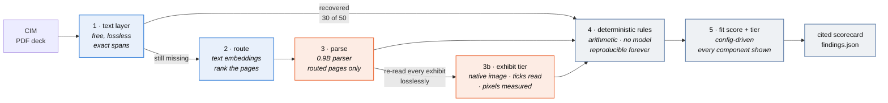
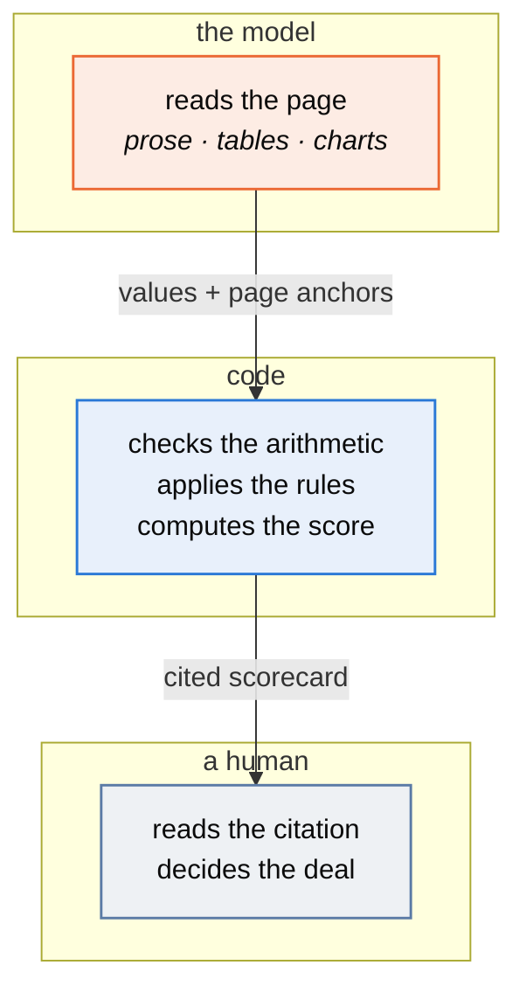

A confidential information memorandum lands in an inbox: 40-odd pages of prose, tables
and charts describing a software company that is for sale. An analyst spends two to
four hours pulling ten numbers out of it into a spreadsheet, checking them against an
investment profile, and writing a one-page recommendation. Around nine in ten of those
memoranda end in "pass".

This is a first pass at that work. Point it at a CIM, get back a cited scorecard: the
metrics, the arithmetic checked, the criteria fit scored, the risks flagged, and a
tier. It does not recommend a transaction. It produces the artifact the analyst was
going to assemble by hand, with every figure traceable to the page it came from, and
hands the judgement back.

```bash
pip install -r requirements.txt
python generate.py                 # build the synthetic corpus (no model, no network)
python screen.py data/             # screen it
python memo.py data/               # draft screening memos with call-outs
python capture.py T05 --edited reports/memo_T05_reviewed.md   # turn a review into records
python bakeoff.py                  # compare page-reader models, identical grading
python run_checks.py               # verify every number in this README, offline
```

Python 3.12, no API key, no account, no paid inference. The parts that need a model
use **local models via Ollama**; everything else is stdlib-first Python. If you have no
models installed, `python screen.py data/ --no-vision` still runs end to end — and the
gap between those two runs is the most interesting thing here.

---

## v1 → v2

v1 (tag `v1.0.0`) stopped at the scorecard: extract the numbers, check the arithmetic,
score the fit, tier the inbox. v2 adds the thing an analyst would start writing next -
the memo - and closes a loop around it:

- **Memos drafted with call-outs.** Every figure cites its page. Values measured off
  a chart axis ship flagged even though the reader now aces the committed eval,
  because a value recovered from a picture is not a value the seller printed.
  Missing metrics arrive as questions to ask, and when a metric's name sits on a
  page the vision tier read, the question says an exhibit exists and beat the
  parser. Narrative observations come from a local model, each with its id attached
  so a reviewer can accept, edit or strike it (`memo.py`).
- **Corrections captured by diff.** The reviewer edits the markdown they were handed;
  `capture.py` turns that edit into structured records. Changes no flag prompted are
  recorded as blind spots - the most useful lines in the file.
- **Corrections teach.** Accepted edits become worked examples for later drafts.
  Extraction gaps become regressions that `run_checks.py` asserts on every run. The
  first session caught p7 of T05 presenting a retention chart while both values read
  as unstated; the loop then fixed it - those values are now measured off the chart's
  own pixels - and the regression asserts they stay recovered.
- **The recursion is gated.** Corrections change the *next* version, never the current
  one, and every fold-back is checked. The system improves on a release cadence a human
  can audit, which is the only kind of improvement an enterprise should accept from
  tooling like this.

Still nothing here recommends a transaction. That was true in v1 and it stays true.

---

## v2 → v3

v2.1 ended with a question the repo had never asked: *is a general vision model even
the right tool for reading these pages?* It worked — 20/20 chart values, every check
green — but "it works" is where good pipelines go to stop being examined. v3 is the
research leg: read what the 2026 document-parsing field actually says, test its
claims on this corpus, and swap only what survives contact with one 16GB AMD GPU.

**What the field says.** Three findings, each from a 2026 primary source, shaped
everything after:

- **Small specialized parsers beat frontier general models at document parsing.**
  On the current OmniDocBench leaderboard (v1.6_full, April 2026), PaddleOCR-VL-1.6
  is a **0.9B-parameter** model scoring 96.34 overall; GPT-5.2 scores 86.59. The
  mechanism is decomposition — layout on a cheap thumbnail, recognition on
  native-resolution crops — which sidesteps the token wall that forces general VLMs
  to downsample dense pages until glyphs go sub-legible and content silently drops.
  That mechanism explains this repo's own v2 failures before it explains anything
  else.
- **The benchmarks cannot make the swap decision.** The top-three leaderboard
  deltas (1.12 points) are smaller than one model's run-to-run spread (DeepSeek-OCR 2:
  90.25 official, 91.09 self-reported, 89.17 re-run by a third party). An audit of
  the benchmark found a 12.08% annotation-error rate, and on broader document
  distributions the best model drops to ~74/100. A leaderboard is a reason to test,
  never a verdict.
- **Charts are the dimension nobody scores.** OmniDocBench strips images from
  predictions before scoring; ParseBench (2026) finds most parsers below 6% on
  charts while general VLMs clear 50%. Nothing in the parser class even attempts
  chart interiors — which is why this repo measures them in code instead
  (`chart_measure.py`), and why that stage survives every swap.

**The bake-off.** Same twenty ground-truth pages, same 120 DPI renders, same
transcription prompt, same grader as Layer P ([`bakeoff.py`](bakeoff.py), caches
committed):

| Reader (single pass) | Prose | Table | Charts (labelled) | Charts (axis) | s/page |
|---|---|---|---|---|---|
| `glm-ocr` (0.9B parser, MIT) | 100% | 100% | **100%** | 0% | **5.0** |
| `deepseek-ocr` (3B, MIT) | 0% | 100% | 0% | 0% | 18.4 |
| `minicpm-v4.6` (1B general VLM, the v2 incumbent) | 100% | 100% | 100% | 0% | 19.2 |

GLM-OCR matches the incumbent on every graded column — including the chart-internal
callout box whose silent drop started v2.1 — at roughly a quarter of the latency.
DeepSeek-OCR is dominated on every axis and carries a disqualifying quirk its card
does not mention: its Ollama port returns an empty string for any prompt longer
than ~50 characters (bisected: 48 chars reads, 83 chars instant-stops), so it
cannot hold the pipeline's *never invent a figure* instruction. Both facts are in
the committed cache. PaddleOCR-VL-1.6, the leaderboard leader, has no Ollama
distribution and its native Paddle runtime is broken under ROCm; it stays a named
round-two candidate rather than a silently dropped one.

**The swap.** The cheap tier is now GLM-OCR. The trigger had to learn the parser's
signature: a specialized reader drops unlabelled chart interiors *and* the word
"chart" along with them, so the escalation rule is now symmetric — **a routed page
whose transcription yields no numeric values escalates, whatever it mentions.** The
strong tier (qwen3.5, reasoning off, native-image crops) still reads exhibits and
tick glyphs; the geometry still measures the axis values; the rules, the scorecard,
and the correction loop are untouched. End-to-end latency fell ~44% (526s → 297s on
this corpus) with less than half the token spend, and every published number
reproduces offline exactly as before.

What v3 did *not* do: chase the leaderboard past the evidence, adopt anything whose
license would not survive a commercial read (one candidate's weights are
non-commercial; another relicensed mid-cycle), or replace working stages because a
benchmark implied it. The wheel was not reinvented — it was borrowed from the
people who measured it, then re-measured here.

**The cross-check tier.** One question was left open on purpose: the research said
an escalation target must *perceive* better, and the strongest open general
multimodal available — Qwen3.8-27B, ten days old when tested — had never been run
against these charts. It read all five retention charts independently: three
endpoint pairs exact, two within 0.2, tick labels digit-identical to the strong
tier's. The research's prediction held — a frontier-class model still *estimates*
on charts — and estimation is exactly one job: disagreeing. So v3.1 adds the
independent read as a cross-check, never as a number: every measured axis value
carries an agreement record from a second perception path over the same pixels.
Agreement within half a gridline gap builds confidence; disagreement puts
"resolve before use" in the memo. The check is optional by design — without the
model installed it skips and the call-outs carry no claim — and the reads are
committed, so the agreement claim itself verifies offline like everything else
here.

---

## The finding

A CIM is a deck, and its numbers do not all live in sentences. In this corpus
**20 of 50 metrics — 40% — exist only inside rasterised charts**, verified absent from
the text layer by a leak check that fails the build if one escapes.

It is not a random 40%. It is gross retention, net retention, largest-customer
concentration and top-five concentration: **every metric that decides whether to buy
the company.** Revenue, margin and EBITDA — which a text layer reads perfectly — only
tell you how big it is.


Here is what that costs where it matters — the same five companies, the same rules,
the only difference being whether the pipeline could read a chart:


Three companies with materially different risk, one identical score. A text-only
pipeline does not degrade gracefully — it goes blind exactly where the decision lives,
and it does so *silently*, because every field it did read, it read correctly.

That is the argument for a heavier parser. Not "vision models are better at tables."

---

## How it works



Steps 1–3 exist to make step 4 possible. Blue is free, orange is the step that costs
something, grey decides nothing on its own.

**The model reads. Code decides. A human signs.** Every number the business acts on is
computed in Python from values a parser extracted, never generated by a model. That is
not caution for its own sake — it is what lets a deal lead re-run a screen from a year
ago and get the same answer, and it is why most of the work costs nothing.

**Routing keeps the expensive step small.** Vector search is arithmetic; reading is
inference. A k=1 router selects 3 of 12 pages, and nothing is lost, because the pages
carrying charts also carry text describing what they show.

**Nothing recommends a transaction.** The tier sorts an inbox. A `Pass` means "not a
fit against this profile", never "bad company" — the profile in `criteria/default.json`
is config, and swapping in a real scorecard is a config change rather than a rewrite.

---

## What it validates

Ten VMS metrics, then eleven deterministic rules over them — ARR tying to annualised
MRR, recurring-revenue floor, retention floors, margin floor, profitability, mandate
band, concentration caps. Each finding is graded blocker / warning / info and carries
its citation.

Two of those rules are worth calling out, because they are where domain judgement shows
up rather than arithmetic:

- **Gross retention above 100% is a definition error.** GRR excludes expansion by
  construction, so a figure above 100 means net retention has been labelled gross.
- **Rule of 40 is computed and deliberately scored at zero weight.** It is a
  growth-investor test: it asks whether a company is buying growth with margin, which
  is the right question when you need a step-up at exit. A permanent-capital buyer is
  not underwriting an exit — it wants a profitable, sticky, slow-growing business, which
  fails Rule of 40 *by construction*. During development this rule fired on all five
  targets including the clean one, which is the tell that a metric has been imported
  from the wrong thesis. It is kept as context and never allowed to move the score.

**A missing metric is a finding, not a zero.** A CIM that omits gross retention has
usually omitted it deliberately, and that becomes the first management-call question
rather than a silent gap in the average.

### Where the trust boundary sits



**The model never computes a number the business acts on.** It extracts with a page
anchor; code does the arithmetic; a human checks the citation and makes the call. That
is what lets a deal lead re-run a screen from a year ago and get the same answer.

---

## The numbers

Reproduce all of them with `python run_checks.py` — offline, from committed artifacts.

**Layer P — what each parse backend makes available.** Percentage of ground-truth
fields recovered *and correctly attributed to their metric*, on the page the value
actually lives on. This grades the parser, not the extractor: it is a ceiling on what
any downstream model could possibly achieve given what it was handed.

See [`reports/layer_p.md`](reports/layer_p.md) for the generated table.

**Layer R — routing.** Recall@k for the page carrying each metric, and the reduction
in pages sent to the vision model. Read the carrier breakdown rather than the
aggregate: routing recovers **100% of chart pages at rank 1** — the only ones that need
a vision model — while ranking prose and table pages poorly, which costs nothing
because those were never going to the expensive step. At k=1 it selects **15 of 60
pages, a 75% cut**, and misses no chart field.
See [`reports/layer_r.md`](reports/layer_r.md).

**The capability boundary worth knowing.** Chart fields split cleanly by whether the
chart printed its data labels — and the boundary is specific, not "bigger is better":

| Backend | Charts with data labels | Charts read off the axis |
|---|---|---|
| text layer | 0% (0/10) | 0% (0/10) |
| `minicpm-v4.6` (1B general VLM, page render) | 100% (10/10) | 0% (0/10) |
| tiered v3: `glm-ocr` pages → `qwen3.5:4b` exhibits | **100% (10/10)** | **100% (10/10)** |

Reading a printed label is recognition. Reading a value off an axis is spatial
reasoning about where a point sits between gridlines. The 1B model cannot do the second
at all — and crucially it **fails loudly**, returning no numbers rather than guessing,
which is what makes cheap-first escalation safe.

**How the axis column closed.** Not with a bigger model. v1 asked the strong tier to
*estimate* each endpoint off a lossy page render, which it did to within a few tenths —
and a few tenths is a miss when the grader, the deal, or the arithmetic needs the
number. v2.1 changed what reads what:

- the model reads the **tick-label glyphs** — recognition, the thing the vision tier
  already does at 100%;
- code finds each series by colour, fits the **centreline of the line entering the
  end marker** (a 13-pixel marker rasterises wherever its sub-pixel phase lands; a
  200-pixel line averages that noise away), and **interpolates against the
  gridlines**.

That is arithmetic, not inference. It re-runs offline from the committed images —
`run_checks.py` asserts all ten axis-read values re-measure exactly, on any machine,
with no GPU and no model. Nothing here is tuned to this corpus: any rendered chart
with gridlines and colour-coded series measures the same way, and a chart that does
not fit that shape falls back to the model's transcription and its flag. The same two
changes — reasoning off, exhibit read from the PDF's own embedded image instead of a
re-rendered page — also recovered chart-internal callout boxes the cheap pass had
been silently dropping.

**Why every exhibit page escalates now, when v1 gated on loud failure.** The gate
existed because escalation cost ~150s a page. At 6-17s an exhibit-level re-read is
cheaper than the misses it prevents — the cheap pass had been dropping annotations
*inside* chart rasters on pages full of numbers, which no ground-truth-free trigger
can see. The axis-versus-label classification that decides flagging is unchanged and
still needs no answer key.

Every axis-read value ships flagged regardless. A value measured off a picture is
still not a value the seller printed, and the flag is where the human signs.

**A tiering lesson that cost real time.** The first escalation trigger escalated any
page mentioning something "unreadable". Across the corpus that fired on **16 of 20
pages**, including prose and table pages the 1B model had already transcribed
perfectly — 1,183s of escalation where roughly two thirds bought nothing. Requiring
*no numbers at all* on the page before escalating brings it to **5 of 20 — exactly the
five unlabelled retention pages — at ~370s.** An escalation trigger is a classifier,
and an unmeasured one quietly spends the budget the tiering was meant to save.
v2.1 then re-measured the tradeoff from the other side: with the escalated step at
6-17s an exhibit, the gate cost more in silent misses than it saved in seconds, and
the trigger loosened to every exhibit page. The lesson cuts both ways — measure the
trigger whenever either side of the tradeoff moves.
([`deal_ready/parse/tiered.py`](deal_ready/parse/tiered.py))

**A caveat stated plainly:** the corpus is synthetic and this repo wrote it. Ground
truth is a by-product of generation rather than labelling after the fact, which
removes one class of error but not the deeper one — a generator and a scorer authored
in the same session are favourable to each other by construction. The
`realworld/` manifest exists to test against public documents this pipeline did not
write.

---

## Honest boundaries

- **Synthetic corpus.** These are generated CIMs modelled on publicly described
  conventions. No real memorandum, no real company, no proprietary deal flow.
- **Extraction is deterministic here, not model-driven.** The end-to-end run tests
  *stated* values against parsed text, which is what keeps it reproducible offline. A
  production build puts a structured-output model call at that seam; the interface and
  the eval harness would not change, which is why the seam exists.
- **The judgement layer is not built yet.** Ashgrove scores well on numbers and is the
  most dangerous company in the corpus — founder-written settlement engine, no
  succession plan, unsupported database, no test coverage. None of that is visible to
  arithmetic. Catching it needs a calibrated judge scored against a held-out labelled
  set, and until that exists this reads the numbers and not the narrative.
- **Not a data-room tool.** The parse answer here would change at 10–50K pages; see
  [`docs/ingest.md`](docs/ingest.md) §8.

---

## Reading order

| File | What it is |
|---|---|
| [`docs/ingest.md`](docs/ingest.md) | **The design record.** Why OCR is the wrong default, why whole-document multimodal is also wrong, what embeddings do and do not do, the corpus-size ladder, what was tried and rejected, and two failures that would have published false findings |
| [`docs/metrics.md`](docs/metrics.md) | Every VMS metric: what it is, why a buy-and-hold acquirer prices on it, how a CIM obscures it |
| [`docs/rules.md`](docs/rules.md) | Every rule with its deal rationale |
| [`docs/callouts.md`](docs/callouts.md) | The judgement seam: call-outs on axis-read values and narrative risk, diff-based correction capture, the fold-back contract |
| [`playbook.md`](playbook.md) | The rollout half: shadow mode, who to build with, what will actually go wrong |
| [`docs/hardware.md`](docs/hardware.md) | Local model setup, AMD/ROCm traps, and three failures that would have published false findings |
| [`criteria/default.json`](criteria/default.json) | The investment profile — config, not code |
| [`deal_ready/scorer/rules.py`](deal_ready/scorer/rules.py) | The deterministic spine |

---

## Layout

```
generate.py            build the synthetic corpus; fails if a chart value leaks to text
screen.py              the CLI an analyst would run
memo.py                draft screening memos with call-outs
capture.py             diff an edited memo into correction records
bakeoff.py             compare page-reader candidates, identical grading
parse_corpus.py        run every parse backend, write Layer P
run_checks.py          reproduce every published number, offline

deal_ready/
  generator/           target profiles + PDF deck rendering
  parse/               text layer · OCR (optional) · vision, behind one interface
  embed/               page routing, MaxSim in numpy, no vector database
  scorer/              deterministic rules + criteria fit
  memo/                memo drafting, call-out derivation, the narrative pass
  models/ollama.py     the single door every model call goes through
  values.py            what counts as recovering a number

criteria/              investment profiles
data/                  generated corpus, ground truth, committed vision cache, review sessions
eval/                  judgement examples folded back from reviewers, regressions
reports/               generated results: findings, layer reports, memos, call-outs
realworld/             manifest of public documents for the spot check (no PDFs committed)
```

Money is whole dollars, integers everywhere. This thing claims figures tie out, and
floats would make that a lie.
