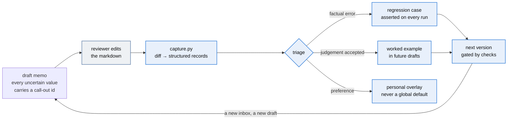

A confidential information memorandum lands in an inbox: forty-odd pages of prose,
tables and charts describing a software company that is for sale. Somewhere in there
are ten numbers an analyst needs. Finding them means two to four hours of reading, a
spreadsheet, and a one-page recommendation, and about nine in ten of those memoranda
end in "pass" anyway.

This is a first pass at that work. Point it at a CIM and you get the artifact the
analyst was going to assemble by hand: the metrics, the arithmetic checked against the
buyer's rubric, a criteria fit and a tier, and a drafted memo where every uncertain
value carries a call-out. Every figure traces to the page it came from. Nothing here
recommends a transaction; the tool sorts an inbox and asks questions, and a human signs.

## Two ways to run it

**As a plugin — nothing to install.** The judgement lives in skills and subagents, so a
fresh agent session can screen a CIM with no clone, no Python, and no models.

```
/plugin marketplace add situhacks/deal-ready
/plugin install deal-ready
/deal-ready:screen path/to/cim.pdf
```

Three commands are exposed: `screen` runs the whole workflow, `review` checks numbers
you already wrote, `research` builds market context on its own.

**As a repo — the substrate and the evidence.** Clone it when you want the local
models, the corpus generator, and the checks that reproduce every number here offline.

```bash
pip install -r requirements.txt
python generate.py                 # build the synthetic corpus (no model, no network)
python screen.py data/             # screen it: scorecards + findings
python memo.py data/               # draft screening memos with call-outs
python review.py data/T05_Ashgrove_CIM.pdf reports/asserted_T05.json   # check your numbers
python run_checks.py               # verify every number in this README, offline
```

Python 3.12, no API key, no account, no paid inference. The parts that need a model use
local models through Ollama. With no models installed, `python screen.py data/
--no-vision` still runs end to end, and the gap between that run and the full one is the
most interesting thing here.

**One rubric, both paths.** `criteria/default.json` is copied into the plugin and
byte-compared by `run_checks.py`, so the two cannot drift into screening by different
standards.

**What you get**

- A **cited scorecard** per target: ten software metrics set against the buyer's
  rubric, eleven deterministic rules, criteria fit and tier. Readable markdown,
  generated from the config, so the rubric and the verdicts are things you can click
  into.
- A **drafted screening memo** where every uncertain value carries a call-out id.
- **Chart-only values measured from pixels**, not guessed by a model, and each one
  independently re-read, with the agreement recorded in the memo.
- A **correction loop**: review the memo, run one command, and your edits become
  regression cases and worked examples that automated checks assert on every future
  run.
- **Reviewer mode**, which inverts the usual arrangement: you write the numbers, it
  checks them against the document and reports what disagrees, what agrees, and **what
  it could not check**. That third bucket is the point — a checker that only speaks when
  it finds something teaches you that silence means correct.
- **Market context** (plugin path): the benchmark band for each deciding metric and
  named comparables, because a metric without a benchmark is not a screen. 81% gross
  retention means nothing until you know the band starts at 90%.

**Review a real run, end to end.** Every artifact below is committed. No re-run needed.
One target (Ashgrove, the most dangerous company in the corpus), the whole loop.

**The process is the same on both paths; these artifacts came from the repo path**, because
that is the one whose numbers re-derive offline. The plugin produces the same shapes — the
market context below is the exception, and came from the plugin path, since researching needs
the web.

| Step | Artifact |
|---|---|
| the input | [`data/T05_Ashgrove_CIM.pdf`](data/T05_Ashgrove_CIM.pdf) |
| the rubric it is judged against | [`reports/scorecard_template.md`](reports/scorecard_template.md) |
| the scorecard | [`reports/scorecard_T05.md`](reports/scorecard_T05.md) - 97.7, tier 1, and one red-letter breach: gross retention 81% against an 85% floor |
| the same scorecard, machine-readable | [`reports/findings.json`](reports/findings.json) |
| the market context | [`reports/market_context_T05.md`](reports/market_context_T05.md) - the four-phase research pass: no agriculture-specific band exists, so it says so, and the proxy puts 81% below the median for a class that should beat it |
| the drafted memo | [`reports/memo_T05.md`](reports/memo_T05.md) - call-out ids on every uncertain value, the chart values and their independent re-read, the questions for the seller |
| the call-outs, machine-readable | [`reports/callouts_T05.json`](reports/callouts_T05.json) |
| a human's review of that memo | [`reports/memo_T05_reviewed.md`](reports/memo_T05_reviewed.md), and the diff-captured session it produced: [`data/corrections/T05_session01.json`](data/corrections/T05_session01.json) |
| what that review taught | [`eval/regressions.json`](eval/regressions.json) and [`eval/judgement_examples.json`](eval/judgement_examples.json) - asserted by `run_checks.py` on every run |

The other four targets live beside these: [`reports/memo_T01.md`](reports/memo_T01.md)
through [`memo_T04.md`](reports/memo_T04.md), their scorecards and call-outs, and the
reader comparison in [`reports/bakeoff.md`](reports/bakeoff.md).

**Contents**: [The walkthrough](#the-walkthrough) · [How it works](#how-it-works) ·
[The loop](#the-loop) · [The finding](#the-finding) · [The numbers](#the-numbers) ·
[The story: v1 → v3](#the-story-v1--v3) · [Honest boundaries](#honest-boundaries) ·
[Inside the plugin](#inside-the-plugin) · [Reading order](#reading-order) ·
[Layout](#layout)

---

## The walkthrough

What actually happens when you point it at a CIM. Five stages, **three places it stops
and waits for you**.

The gates are not decoration. The values most likely to be wrong are the ones a reader
cannot tell apart from the ones that are right, so the workflow surfaces them before
they are scored rather than after they are signed.

### 1 · Read

A reader worker goes through the pages and returns structured values — each with the
page it came from and **how it was read**:

| `read` | Means | Trust |
|---|---|---|
| `text` | Printed in prose | high |
| `table` | A labelled table cell | high |
| `label` | A printed value on a chart | high |
| `axis` | **Measured** off chart geometry — nothing printed says it | **low, always** |

That last row is the whole reason this tool exists. On the sample target, gross
retention is not written anywhere: it is a dot on a line chart, and it is the number
that breaches the rubric.

### 2 · Compute

Deterministic. Arithmetic and thresholds from `criteria/default.json` — eleven rules, a
fit score, a tier. **No model computes a number the business acts on.** Derived values
are computed rather than trusted, and a stated figure that disagrees with a computed one
becomes a definition conflict, not a rounding decision.

### 3 · ⏸ Gate — confirm the uncertain reads

It shows you every value with its read type and stops. You confirm or correct anything
measured off an axis **before it is scored**. Answer in chat; it carries on from there.

### 4 · Research

**A metric without a benchmark is not a screen.** 81% gross retention means nothing until
you know where the band starts. So this stage is a scoped four-phase research pass, not a
lookup — worked example in
[`reports/market_context_T05.md`](reports/market_context_T05.md).

**Phase 1 · Scope.** Name the vertical as narrowly as the evidence will support, list only
the metrics that move the tier, and state the as-of window. Metrics that decide nothing do
not get researched.

**Phase 2 · Four typed passes**, run separately because they ask different questions:

| Pass | The question | Good output |
|---|---|---|
| Benchmark | What is normal here? | A range, dated, from a named source |
| Comparable | What did similar businesses transact at? | Named deals, values, multiples |
| Trend | Which way is this vertical moving? | Dated direction with a magnitude |
| **Critical** | **What would make this worse than the band suggests?** | Specific, falsifiable risks |

**The critical pass is not optional.** A context block that only found reasons the number
looks fine has not been researched, it has been confirmed.

Every finding is an atom, and no claim survives without all five fields — statement, source,
URL, a verbatim quote under 125 characters, and a date — plus a tier: `primary` (a
statistical agency, a filing, the transacting party), `practitioner` (a bank or research
house publishing methodology), or `vendor` (anyone selling something adjacent).

**Phase 3 · Coverage gate.** Every deciding metric has a band **or a named gap**. No band
rests on a single vendor-tier source. M&A and VC multiples are labelled separately — they
differ by 35–50% and conflating them inflates everything downstream. Contradictions are
carried as contradictions, never averaged into a middle number no source supports.

**Phase 4 · Write it grounded**, ending in the limitations. A context block whose
limitations section is empty is not finished.

The researcher **never sees the document**. It gets metric names, values, and the vertical —
a confidential CIM must not end up in a web query, so that isolation is enforced by the
agent's tool allowlist and asserted in `run_checks.py`, not promised in a paragraph.

**And context is never a verdict.** It does not move a score or a tier. On T05 it found no
agriculture-specific retention band exists at all — reported as a gap rather than papered
over — and that against the nearest proxy, 81% sits below the 84% median for a class of
business that should be *beating* that median. The rubric said "missed a floor by four
points." The research said "underperforms the peer set it should outperform." Same number,
different question to ask about it.

### 5 · ⏸ Gate — the scorecard, in context

Scorecard beside the benchmarks, so each number is read against something. Anything
still unresolved is named. It asks whether to draft.

### 6 · Draft

A memo where every figure cites its page and every uncertain value carries a call-out —
and a call-out is a **question with an answer that would resolve it**, not a warning
label. Four kinds: axis read, missing metric, definition conflict, judgement.

### 7 · ⏸ Gate — hand back

What was written, and what is still open. It does not close on a summary implying more
certainty than the file has.

### Then the loop closes

Edit the memo. `python capture.py` diffs your edits into correction records: accepted
judgement becomes a worked example in future prompts, and extraction gaps become
regression cases `run_checks.py` asserts forever. **The corrections you make are the
only training signal, and they are gated, committed, and reviewable.**

---

## How it works

```mermaid
flowchart LR
    PDF["CIM<br/>PDF deck"] --> TL["1 · text layer<br/><i>free, lossless<br/>exact spans</i>"]
    TL -->|"recovered<br/>30 of 50"| RULES
    TL -->|"still missing"| RT["2 · route<br/><i>text embeddings<br/>rank the pages</i>"]
    RT --> V["3 · read<br/><i>0.9B parser<br/>routed pages only</i>"]
    V -->|"page yields<br/>no values"| CH["3b · chart specialist<br/><i>one call: labels · ticks<br/>· estimates</i>"]
    CH --> GEO["3c · geometry<br/><i>code measures the pixels<br/>against those ticks</i>"]
    V --> RULES
    GEO --> RULES
    RULES["4 · deterministic rules<br/><i>arithmetic · no model<br/>reproducible forever</i>"] --> FIT["5 · fit score + tier<br/><i>config-driven<br/>every component shown</i>"]
    FIT --> OUT["cited scorecard<br/>findings.json"]

    classDef free fill:#e8f0fb,stroke:#2a78d6,stroke-width:1.5px,color:#0b0b0b
    classDef paid fill:#fdece4,stroke:#eb6834,stroke-width:1.5px,color:#0b0b0b
    classDef det  fill:#eef1f4,stroke:#5b7ba6,stroke-width:1.5px,color:#0b0b0b
    class TL,RT free
    class V,CH,GEO paid
    class RULES,FIT,OUT det
```



Steps 1–3 exist to make step 4 possible. Blue is free, orange is the step that costs
something, grey decides nothing on its own.

**The model reads. Code decides. A human signs.** No number the business acts on is
computed by a model. That discipline is what lets a deal lead re-run a screen from a
year ago and get the same answer, and it is why most of the work costs nothing.

**We asked whether the strongest model should just read everything.** It is the
obvious question, and the bake-off answered it by measuring every candidate as a
full-page reader on the same pages ([`reports/bakeoff.md`](reports/bakeoff.md)). The
newest open frontier model read 80% of prose fields (it paraphrases), 80% of chart
values, at 148 seconds a page. A 0.9B specialized parser read 100% of prose, tables
and labelled charts in 5 seconds, and dropped unlabelled chart interiors entirely.
There was no single winner. There was a best reader for each job, so the pipeline
assigns each job directly: the parser reads every routed page, and a page that yields
no values goes straight to the frontier model, whose one call supplies the series
labels, the tick glyphs, and its own estimated values. Code then measures the
endpoints from the pixels against those ticks. The estimates are never used as
numbers. They exist to be compared with the measurement, and the memo reports whether
the two paths agree.

**Nothing recommends a transaction.** The tier sorts an inbox. A `Pass` means "not a
fit against this profile", and never "bad company". The profile in
`criteria/default.json` is config, so swapping in a real buyer's scorecard is a
config change rather than a rewrite.

---

## The loop

The pipeline is a straight line. The loop is what makes the tool improve, and it
starts with a human:



Reviewer corrections are the real eval set. Three properties make this a loop rather
than a suggestion box:

- **Blind spots are the headline metric.** When a reviewer corrects something no flag
  prompted, the record says so. Those are the most valuable lines in the file, because
  they measure what the system did not even know to flag.
- **Every accepted correction must teach.** If an accepted judgement never became a
  worked example, or an extraction gap was never locked by a regression,
  `run_checks.py` fails.
- **Corrections change the next version, never the current one.** The recursion runs
  on a release cadence a person can audit, and the changelog names who taught what.

The first review session proved the whole loop in miniature. A reviewer caught page 7
of one target announcing a retention chart while both values came back unread. That
blind spot became a mechanical upgrade, the upgrade became a fix, and two regressions
now fail if those values ever go dark again.

---

## The finding

A CIM is a deck, and its numbers do not all live in sentences. In this corpus **20 of
50 metrics exist only inside rasterised charts**, and a leak check fails the build if
one of them escapes into the text layer.

It is not a random 40%. It is gross retention, net retention, largest-customer
concentration and top-five concentration: the metrics that decide whether to buy the
company. Revenue, margin and EBITDA, which a text layer reads perfectly, only tell
you how big it is.


The same five companies, the same rules, the only difference being whether the
pipeline could read a chart:


Only two bars here, deliberately: the plugin path reads the same values, so it produces
the same scores. There is no third line to draw. The difference between substrates is
cost and reproducibility, not what they see —
[`reports/substrate_comparison.md`](reports/substrate_comparison.md).

Three companies with materially different risk, one identical score. A text-only
pipeline does not degrade gracefully. It goes blind exactly where the decision lives,
and it does so silently, because every field it did read, it read correctly.

---

## The numbers

Reproduce all of them with `python run_checks.py`, offline, from committed artifacts.

**Layer P — what each parse backend makes available.** The percentage of ground-truth
fields recovered and correctly attributed to their metric, on the page the value
actually lives on. This grades the parser, not the extractor: it is a ceiling on what
anything downstream could achieve. See
[`reports/layer_p.md`](reports/layer_p.md).

**Layer R — routing.** Recall@k for the page carrying each metric, and how many pages
the vision step has to read. Routing recovers 100% of chart pages at rank 1, so at
k=1 it selects 15 of 60 pages, a 75% cut, and misses no chart field. See
[`reports/layer_r.md`](reports/layer_r.md).

**The capability boundary.** Chart fields split cleanly by whether the chart printed
its data labels, and the boundary is specific:

| Backend | Charts with data labels | Charts read off the axis |
|---|---|---|
| text layer | 0% (0/10) | 0% (0/10) |
| `minicpm-v4.6` (1B general VLM, page render) | 100% (10/10) | 0% (0/10) |
| `glm-ocr` (0.9B parser, page render) | 100% (10/10) | 0% (0/10) |
| `qwen3.8:27b` (open frontier, page render) | 100% (10/10) | 80% (8/10) |
| production pipeline (parser + chart specialist + geometry) | **100% (10/10)** | **100% (10/10)** |
| **plugin path** (frontier reader, one page at a time) | **100% (10/10)** | **100% (10/10)** |

**Both substrates read this corpus perfectly** — 20 of 20 chart-carried values, exact,
no tolerance applied ([`reports/substrate_comparison.md`](reports/substrate_comparison.md)).
Note that the last two rows are not a like-for-like model comparison: the bake-off row
above graded a model as a full-page reader over a whole document, while the plugin path
reads one chart page at a time with explicit instructions. Task framing is doing work
there, not only model capability.

Reading a printed label is recognition. Reading a value off an axis is spatial
reasoning, and every model that tries it estimates: the frontier model landed three
of five endpoint pairs exact and two within 0.2, which sounds fine until the
arithmetic needs the number. So the pipeline measures instead. The chart model reads
the tick glyphs once. Code finds each series by colour, fits the centreline of the
line entering the end marker (a 13-pixel marker rasterises wherever its sub-pixel
phase lands; a 200-pixel line averages that noise away), and interpolates against
the gridlines. That is arithmetic, and `run_checks.py` re-runs it from the committed
images on any machine, with no GPU and no model.

**Which substrate, then?** Not an accuracy question — on this corpus there is nothing to
choose between them. The difference is elsewhere:

| | Local | Plugin |
|---|---|---|
| Latency, 1 target (warm cache) | 2.6s | seconds per page, 2 pages |
| Marginal cost per document | electricity | tokens |
| Needs | a GPU and three pulled models | nothing |
| **Re-derivable by a third party, offline, forever** | **yes** | **no — it can only be re-run** |
| Failure mode | loud: an unreadable page is reported unresolved | model-shaped: a confident wrong number is possible |

**That fourth row is the one that decides it.** `run_checks.py` re-measures every axis
value from committed pixels on any machine with no GPU and no model, so a number the
local path produced can be re-derived by someone who does not trust you. A number the
plugin produced can only be re-run. For a screen a deal lead may have to defend a year
later, those are not the same property — which is why the plugin is the convenient way
in and the repo is the one that publishes numbers.

**A caveat stated plainly:** the corpus is synthetic and this repo wrote it. Ground
truth is a by-product of generation rather than labelling after the fact, which
removes one class of error and leaves another: a generator and a scorer authored in
the same session are favourable to each other by construction. The `realworld/`
manifest exists to test against public documents this pipeline did not write.

---

## The story: v1 → v3

**v1 asked whether the work could be done at all, locally.** The text layer, the
embedding router, tiered local vision, deterministic rules, and the finding that the
decisive 40% of metrics live only in charts. Every model output was committed, so
every number could be re-verified without a GPU.

**v2 asked what the analyst would write next.** The memo, with call-outs derived
mechanically; diff-based correction capture; and the fold-back contract. Its first
review session caught a real blind spot, and that lesson became the regression that
still guards it.

**v2.1 asked why the axis column sat at 70%.** The strong tier was estimating:
reasoning on, lossy page renders. Reasoning off, exhibit re-reads from the PDF's own
embedded image, and pixel measurement in code closed it to 20/20, and the last
change made the axis values verifiable offline like everything else.

**v3 asked whether any of this was the right way, or just our way.** A research wave
read the 2026 document-parsing field and found specialized parsers beating frontier
models at transcription, no benchmark scoring chart interiors at all, and
leaderboard gaps smaller than run-to-run noise. So the swap was decided the only way
that could be trusted: a bake-off on these pages. The reader changed; the guarantees
did not. Then the frontier model's confirmed estimation habit became a control
instead of a risk.

**What v3 did not do:** chase a leaderboard past the evidence, adopt weights whose
license would not survive a commercial read, or replace working stages because a
benchmark implied it.

---

## Honest boundaries

- **The corpus is synthetic**, modelled on publicly described conventions. No real
  memorandum, no real company, no proprietary deal flow.
- **Extraction is deterministic here, not model-driven.** The end-to-end run tests
  stated values against parsed text, which is what keeps it reproducible offline. A
  production build puts a structured-output model call at that seam; the interface
  and the eval harness would not change, which is why the seam exists.
- **The narrative judgement layer ships as flagged suggestions, not a detector.**
  Founder risk, succession gaps, unsupported technology: none of that is visible to
  arithmetic. The memo carries model observations with ids attached so a reviewer can
  accept, edit or strike them. A calibrated judge against a held-out labelled set is
  future work, stated as such.
- **This is not a data-room tool.** The parse answer changes at 10–50K pages; see
  [`docs/ingest.md`](docs/ingest.md) §8.
- **The plugin has been cold-started once, not installed once.** An agent with no context
  found the instructions and screened a target correctly
  ([`reports/coldstart_test.md`](reports/coldstart_test.md)), but it read the plugin off
  the filesystem rather than through the marketplace. Command registration and skill
  auto-routing are still unverified, and stages past the first gate have never run end to
  end because no gate has been answered by a human.
- **`data/ground_truth.json` sits beside the corpus a screener is pointed at.** That is
  convenient for the eval harness and a hazard for anything that globs `data/`. It is why
  the cold-start test forbids it explicitly.

---

## Inside the plugin

`plugins/deal-ready/` carries the judgement layer. It installs on its own and needs no
Python, no models, and no clone.

**Three commands.** `/deal-ready:screen` runs the workflow above. `/deal-ready:review`
checks numbers you already wrote. `/deal-ready:research` builds market context alone.

**Four agents, each with a tool allowlist rather than a note asking nicely.** The
isolation is the security claim this thing makes, so it is tested — grant the researcher
`Read` and the check suite goes red.

| Agent | Holds | Notably cannot |
|---|---|---|
| `deal-screener` | Read, Grep, Glob, Task | write, browse |
| `page-reader` | Read, Grep, Glob | write, browse, delegate |
| `market-researcher` | WebSearch, WebFetch | **read anything** — it never sees the CIM |
| `memo-writer` | Read, Write | browse, delegate |

**Six skills.** `cim-screen` (the workflow and its gates) · `cim-read` (what a correct
read is, and when to refuse to produce a number) · `deal-rules` (the rubric) ·
`review-check` (reviewer mode) · `market-context` (a four-phase research pass —
benchmark, comparable, trend, and a **critical** pass that asks what would make the
number worse) · `memo-draft` (memo structure and call-out grammar).

**For the repo path**, Ollama with `glm-ocr`, `qwen3.8:27b` and `nomic-embed-text`.
Everything degrades visibly without them, never silently.
[`AGENTS.md`](AGENTS.md) remains the agent-agnostic entry for Codex-class CLIs.

---

## Reading order

| File | What it is |
|---|---|
| [`docs/ingest.md`](docs/ingest.md) | **The design record.** Why OCR is the wrong default, why whole-document multimodal is also wrong, what embeddings do and do not do, the corpus-size ladder, what was tried and rejected, and two failures that would have published false findings |
| [`docs/metrics.md`](docs/metrics.md) | Every metric the screen reads: what it is, why a buy-and-hold acquirer prices on it, how a CIM obscures it |
| [`docs/rules.md`](docs/rules.md) | Every rule with its deal rationale |
| [`docs/callouts.md`](docs/callouts.md) | The judgement seam: call-outs, diff-based correction capture, the fold-back contract |
| [`playbook.md`](playbook.md) | The rollout half: shadow mode, who to build with, what will actually go wrong |
| [`docs/hardware.md`](docs/hardware.md) | Local model setup, AMD/ROCm traps, and three failures that would have published false findings |
| [`reports/bakeoff.md`](reports/bakeoff.md) | The reader comparison that chose the current stack, with committed per-model caches |
| [`reports/scorecard_T05.md`](reports/scorecard_T05.md) | A finished scorecard, as the reviewer reads it; the template it is judged against sits beside it |
| [`reports/review_T05.json`](reports/review_T05.json) | Reviewer mode on a sheet with two deliberate errors in seven values: both caught, the axis read flagged as measured rather than printed |
| [`reports/substrate_comparison.md`](reports/substrate_comparison.md) | **Both readers on all 20 chart-carried values.** 20/20 each, exact — and why that means accuracy is not what separates them |
| [`reports/agent_read_T05.md`](reports/agent_read_T05.md) | The first spot check, superseded by the comparison above but kept for its note on how the two read types were decided |
| [`reports/coldstart_test.md`](reports/coldstart_test.md) | **An agent that had never seen this repo, given only a path and told to find the instructions.** What it got right, the six defects it found, and the worse one it surfaced by accident |
| [`criteria/default.json`](criteria/default.json) | The investment profile — config, not code |
| [`CHANGELOG.md`](CHANGELOG.md) | Version by version, with what taught what |

---

## Layout

```
generate.py            build the synthetic corpus; fails if a chart value leaks to text
screen.py              the CLI an analyst would run: findings + readable scorecards
memo.py                draft screening memos with call-outs
review.py              check your numbers against the document: three buckets
capture.py             diff an edited memo into correction records
bakeoff.py             compare page-reader candidates, identical grading
parse_corpus.py        run every parse backend, write Layer P
run_checks.py          reproduce every published number, offline

plugins/deal-ready/    the judgement layer: commands, agents, skills, the rubric copy
  commands/            screen · review · research
  agents/              four workers, each with a tool allowlist
  skills/              what a correct read is, the rubric, the research method

deal_ready/
  review.py            reviewer mode: disagreed · agreed · could not check
  generator/           target profiles + PDF deck rendering
  parse/               text layer · reading pipeline · chart geometry, one interface
  embed/               page routing, MaxSim in numpy, no vector database
  scorer/              deterministic rules + criteria fit
  scorecard.py         renders the rubric and per-target scorecards as markdown
  memo/                memo drafting, call-out derivation, the narrative pass
  models/ollama.py     the single door every model call goes through
  values.py            what counts as recovering a number

criteria/              investment profiles
data/                  generated corpus, ground truth, committed model caches, review sessions
eval/                  judgement examples folded back from reviewers, regressions
reports/               generated results: findings, scorecards, memos, call-outs, bake-off
realworld/             manifest of public documents for the spot check (no PDFs committed)
```

Money is whole dollars, integers everywhere. This thing claims figures tie out, and
floats would make that a lie.
