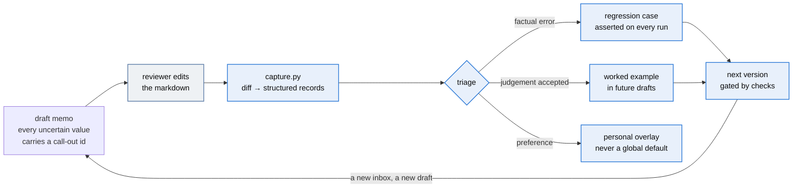

A confidential information memorandum lands in an inbox: 40-odd pages of prose, tables
and charts describing a software company that is for sale. An analyst spends two to
four hours pulling ten numbers out of it into a spreadsheet, checking them against an
investment profile, and writing a one-page recommendation. Around nine in ten of those
memoranda end in "pass".

This is a first pass at that work. Point it at a CIM, get back a cited scorecard: the
metrics, the arithmetic checked, the criteria fit scored, the risks flagged, and a
tier. It does not recommend a transaction. It produces the artifact the analyst was
going to assemble by hand, with every figure traceable to the page it came from, and
hands the judgement back.

```bash
pip install -r requirements.txt
python generate.py                 # build the synthetic corpus (no model, no network)
python screen.py data/             # screen it
python memo.py data/               # draft screening memos with call-outs
python capture.py T05 --edited reports/memo_T05_reviewed.md   # turn a review into records
python run_checks.py               # verify every number in this README, offline
```

Python 3.12, no API key, no account, no paid inference. The parts that need a model
use **local models via Ollama**; everything else is stdlib-first Python. If you have no
models installed, `python screen.py data/ --no-vision` still runs end to end — and the
gap between those two runs is the most interesting thing here.

**What you get**

- A **cited scorecard** per target: ten VMS metrics, eleven deterministic rules,
  criteria fit and tier - every figure traceable to its page.
- A **drafted screening memo** where every uncertain value carries a call-out id.
- **Chart-only values measured from pixels**, not guessed by a model - and each one
  independently cross-read, with the agreement recorded in the memo.
- A **correction loop**: review the memo, run one command, and your edits become
  regression cases and worked examples that the checks assert on every future run.

**Contents**: [How it works](#how-it-works) · [The loop](#the-loop) ·
[The finding](#the-finding) · [The numbers](#the-numbers) ·
[The story: v1 → v3](#the-story-v1--v3) · [Honest boundaries](#honest-boundaries) ·
[Using it as a skill](#using-it-as-a-skill) · [Reading order](#reading-order) ·
[Layout](#layout)

---

## How it works

```mermaid
flowchart LR
    PDF["CIM<br/>PDF deck"] --> TL["1 · text layer<br/><i>free, lossless<br/>exact spans</i>"]
    TL -->|"recovered<br/>30 of 50"| RULES
    TL -->|"still missing"| RT["2 · route<br/><i>text embeddings<br/>rank the pages</i>"]
    RT --> V["3 · read<br/><i>0.9B parser<br/>routed pages only</i>"]
    V -->|"page yields<br/>no values"| CH["3b · chart specialist<br/><i>one call: labels · ticks<br/>· estimates</i>"]
    CH --> GEO["3c · geometry<br/><i>code measures the pixels<br/>against those ticks</i>"]
    V --> RULES
    GEO --> RULES
    RULES["4 · deterministic rules<br/><i>arithmetic · no model<br/>reproducible forever</i>"] --> FIT["5 · fit score + tier<br/><i>config-driven<br/>every component shown</i>"]
    FIT --> OUT["cited scorecard<br/>findings.json"]

    classDef free fill:#e8f0fb,stroke:#2a78d6,stroke-width:1.5px,color:#0b0b0b
    classDef paid fill:#fdece4,stroke:#eb6834,stroke-width:1.5px,color:#0b0b0b
    classDef det  fill:#eef1f4,stroke:#5b7ba6,stroke-width:1.5px,color:#0b0b0b
    class TL,RT free
    class V,CH,GEO paid
    class RULES,FIT,OUT det
```



Steps 1–3 exist to make step 4 possible. Blue is free, orange is the step that costs
something, grey decides nothing on its own.

**The model reads. Code decides. A human signs.** Every number the business acts on is
computed in Python from values a parser extracted, never generated by a model. That is
not caution for its own sake — it is what lets a deal lead re-run a screen from a year
ago and get the same answer, and it is why most of the work costs nothing.

**The best reader for each job, assigned directly.** A bake-off
([`reports/bakeoff.md`](reports/bakeoff.md)) measured every candidate as a full-page
reader, and no single model won: a 0.9B parser reads prose, tables and labelled
charts perfectly at 5 seconds a page but drops unlabelled chart interiors entirely;
the newest open frontier model reads 80% of chart values single-pass but paraphrases
away prose at 30x the latency. So the pipeline assigns each job to its measured best
and never runs a cheap pass hoping it suffices. A routed page that yields values is
done; a page that yields none goes straight to the chart specialist, whose one call
supplies the series labels, the tick glyphs, and - never as numbers - its own
estimated reads. Code measures the endpoints against those ticks. The estimates then
serve as the independent cross-check: agreement within half a gridline gap builds
confidence in the memo, disagreement prints "resolve before use".

**Nothing recommends a transaction.** The tier sorts an inbox. A `Pass` means "not a
fit against this profile", never "bad company" — the profile in `criteria/default.json`
is config, and swapping in a real scorecard is a config change rather than a rewrite.

---

## The loop

The pipeline is the straight line; the loop is what makes the tool improve. Review a
drafted memo, run one command, and the corrections become permanent, asserted
infrastructure:



Three properties make it a loop rather than a suggestion box:

- **Blind spots are the headline metric.** Corrections no flag prompted are recorded
  as such - the reviewer caught what the system did not even flag - and they are the
  most useful lines in the file.
- **Every accepted correction must teach.** `run_checks.py` fails if an accepted
  judgement never became a worked example, or an extraction gap was never locked by a
  regression.
- **Corrections change the next version, never the current one.** The recursion runs
  on a release cadence a human can audit - the changelog names who taught what.

The first session proved the whole loop in miniature: a reviewer caught page 7 of one
target announcing a retention chart while both values came back unread. That blind
spot became a mechanical upgrade, the upgrade became a fix, and the fix is now
asserted by two regressions that fail if the values ever go dark again.

---

## The finding

A CIM is a deck, and its numbers do not all live in sentences. In this corpus
**20 of 50 metrics — 40% — exist only inside rasterised charts**, verified absent from
the text layer by a leak check that fails the build if one escapes.

It is not a random 40%. It is gross retention, net retention, largest-customer
concentration and top-five concentration: **every metric that decides whether to buy
the company.** Revenue, margin and EBITDA — which a text layer reads perfectly — only
tell you how big it is.


Here is what that costs where it matters — the same five companies, the same rules,
the only difference being whether the pipeline could read a chart:


Three companies with materially different risk, one identical score. A text-only
pipeline does not degrade gracefully — it goes blind exactly where the decision lives,
and it does so *silently*, because every field it did read, it read correctly.

That is the argument for a heavier parser. Not "vision models are better at tables."

---

## The numbers

Reproduce all of them with `python run_checks.py` — offline, from committed artifacts.

**Layer P — what each parse backend makes available.** Percentage of ground-truth
fields recovered *and correctly attributed to their metric*, on the page the value
actually lives on. This grades the parser, not the extractor: it is a ceiling on what
any downstream model could possibly achieve given what it was handed.

See [`reports/layer_p.md`](reports/layer_p.md) for the generated table.

**Layer R — routing.** Recall@k for the page carrying each metric, and the reduction
in pages sent to the vision model. Read the carrier breakdown rather than the
aggregate: routing recovers **100% of chart pages at rank 1** — the only ones that need
a model — while ranking prose and table pages poorly, which costs nothing
because those were never going to the expensive step. At k=1 it selects **15 of 60
pages, a 75% cut**, and misses no chart field.
See [`reports/layer_r.md`](reports/layer_r.md).

**The capability boundary worth knowing.** Chart fields split cleanly by whether the
chart printed its data labels — and the boundary is specific, not "bigger is better":

| Backend | Charts with data labels | Charts read off the axis |
|---|---|---|
| text layer | 0% (0/10) | 0% (0/10) |
| `minicpm-v4.6` (1B general VLM, page render) | 100% (10/10) | 0% (0/10) |
| `glm-ocr` (0.9B parser, page render) | 100% (10/10) | 0% (0/10) |
| `qwen3.8:27b` (open frontier, page render) | 100% (10/10) | 80% (8/10) |
| production pipeline (parser + chart specialist + geometry) | **100% (10/10)** | **100% (10/10)** |

Reading a printed label is recognition. Reading a value off an axis is spatial
reasoning about where a point sits between gridlines. The generalists estimate it -
the frontier model lands three-of-five endpoint pairs exact and two within 0.2 - and
an estimate is a miss when the arithmetic needs the number. So the pipeline measures:
the chart model reads the tick glyphs once, code fits the centreline of the line
entering the end marker (a 13-pixel marker rasterises wherever its sub-pixel phase
lands; a 200-pixel line averages that noise away), and interpolates against the
gridlines. That is arithmetic, not inference, and it re-runs offline from the
committed images - `run_checks.py` asserts all ten axis-read values re-measure
exactly, on any machine, with no GPU and no model.

**Why not just use the strongest model everywhere?** Because the bake-off measured
that too, and it is worse: 80% of prose fields (it paraphrases), 80% of axis values,
at thirty times the latency. The strongest model is the best chart specialist and a
mediocre page reader; the 0.9B parser is the best page reader and cannot read a chart
at all. The pipeline is not a ladder of fallbacks - it is the measured-best reader
for each job, assigned directly.

**A caveat stated plainly:** the corpus is synthetic and this repo wrote it. Ground
truth is a by-product of generation rather than labelling after the fact, which
removes one class of error but not the deeper one — a generator and a scorer authored
in the same session are favourable to each other by construction. The
`realworld/` manifest exists to test against public documents this pipeline did not
write.

---

## The story: v1 → v3

**v1 — a thought, made runnable.** Could the screening work be reproduced at all,
locally, with nothing but a PDF and a consumer GPU? v1 answered with the text layer,
the embedding router, and the finding that the decisive 40% of metrics live only in
charts - then tiered local vision to reach them, deterministic rules to score them,
and committed caches so every number could be verified without a GPU.

**v2 — deeper into the specifics.** The scorecard stopped at arithmetic; an analyst
would start writing next. v2 added the memo, with call-outs derived mechanically
(axis reads flagged, missing metrics framed as questions, narrative observations
carrying ids), diff-based correction capture, and the fold-back contract: accepted
edits become worked examples, extraction gaps become regressions, and three new
checks assert the loop actually teaches. Its first review session caught a real blind
spot - a retention chart both values unread - which became a mechanical upgrade and
the regression that still guards it.

**v2.1 — the measurement.** The axis column sat at 70% because the strong tier was
estimating: reasoning on, lossy page renders. Three changes closed it to 20/20 -
reasoning off at the model door, exhibit re-reads from the PDF's own embedded image,
and pixel measurement in code - and the last of those made the axis values verifiable
offline like everything else.

**v3 — take from the greatest, then re-measure.** Before building anything, a
research wave read the 2026 document-parsing field: specialized parsers beat frontier
general models at transcription (a 0.9B model leads OmniDocBench at 96.34 vs GPT-5.2's
86.59), no benchmark scores chart interiors at all, and top-of-leaderboard deltas are
smaller than one model's run-to-run spread - so the swap decision could only be made
on this repo's own pages. The bake-off swapped the page reader to GLM-OCR (identical
quality, ~4x the speed, 44% faster end-to-end) and v3.1 turned the frontier model's
confirmed estimation habit into a control: the cross-check.

**What v3 deliberately did not do:** chase a leaderboard past the evidence, adopt
weights whose license would not survive a commercial read, or replace working stages
because a benchmark implied it.

---

## Honest boundaries

- **Synthetic corpus.** These are generated CIMs modelled on publicly described
  conventions. No real memorandum, no real company, no proprietary deal flow.
- **Extraction is deterministic here, not model-driven.** The end-to-end run tests
  *stated* values against parsed text, which is what keeps it reproducible offline. A
  production build puts a structured-output model call at that seam; the interface and
  the eval harness would not change, which is why the seam exists.
- **The narrative judgement layer is a flagged suggestion, not a detector.** Founder
  risk, succession gaps, unsupported technology - none of that is visible to
  arithmetic, and the memo ships model observations with ids attached so a reviewer
  can accept, edit or strike them. A calibrated judge against a held-out labelled set
  is future work, stated as such.
- **Not a data-room tool.** The parse answer here would change at 10–50K pages; see
  [`docs/ingest.md`](docs/ingest.md) §8.

---

## Using it as a skill

The repository is shaped to drop into an agent:

- **Claude Code**: copy or clone the repo as a skill folder - [`SKILL.md`](SKILL.md)
  at the root carries the name, the trigger description, and the five-command
  walk-through.
- **Any AGENTS.md-reading agent** (Codex-class CLIs, ChatGPT desktop workspace):
  [`AGENTS.md`](AGENTS.md) at the root is the agent-agnostic entry point, with the
  hard rules and pointers.
- **Requirements**: Ollama with `glm-ocr`, `qwen3.8:27b` and `nomic-embed-text`
  pulled; everything degrades visibly without them, never silently.

---

## Reading order

| File | What it is |
|---|---|
| [`docs/ingest.md`](docs/ingest.md) | **The design record.** Why OCR is the wrong default, why whole-document multimodal is also wrong, what embeddings do and do not do, the corpus-size ladder, what was tried and rejected, and two failures that would have published false findings |
| [`docs/metrics.md`](docs/metrics.md) | Every VMS metric: what it is, why a buy-and-hold acquirer prices on it, how a CIM obscures it |
| [`docs/rules.md`](docs/rules.md) | Every rule with its deal rationale |
| [`docs/callouts.md`](docs/callouts.md) | The judgement seam: call-outs, diff-based correction capture, the fold-back contract |
| [`playbook.md`](playbook.md) | The rollout half: shadow mode, who to build with, what will actually go wrong |
| [`docs/hardware.md`](docs/hardware.md) | Local model setup, AMD/ROCm traps, and three failures that would have published false findings |
| [`reports/bakeoff.md`](reports/bakeoff.md) | The reader comparison that chose the current stack, with committed per-model caches |
| [`criteria/default.json`](criteria/default.json) | The investment profile — config, not code |
| [`CHANGELOG.md`](CHANGELOG.md) | Version by version, with what taught what |

---

## Layout

```
generate.py            build the synthetic corpus; fails if a chart value leaks to text
screen.py              the CLI an analyst would run
memo.py                draft screening memos with call-outs
capture.py             diff an edited memo into correction records
bakeoff.py             compare page-reader candidates, identical grading
parse_corpus.py        run every parse backend, write Layer P
run_checks.py          reproduce every published number, offline

deal_ready/
  generator/           target profiles + PDF deck rendering
  parse/               text layer · reading pipeline · chart geometry, one interface
  embed/               page routing, MaxSim in numpy, no vector database
  scorer/              deterministic rules + criteria fit
  memo/                memo drafting, call-out derivation, the narrative pass
  models/ollama.py     the single door every model call goes through
  values.py            what counts as recovering a number

criteria/              investment profiles
data/                  generated corpus, ground truth, committed model caches, review sessions
eval/                  judgement examples folded back from reviewers, regressions
reports/               generated results: findings, layer reports, memos, call-outs, bake-off
realworld/             manifest of public documents for the spot check (no PDFs committed)
```

Money is whole dollars, integers everywhere. This thing claims figures tie out, and
floats would make that a lie.
